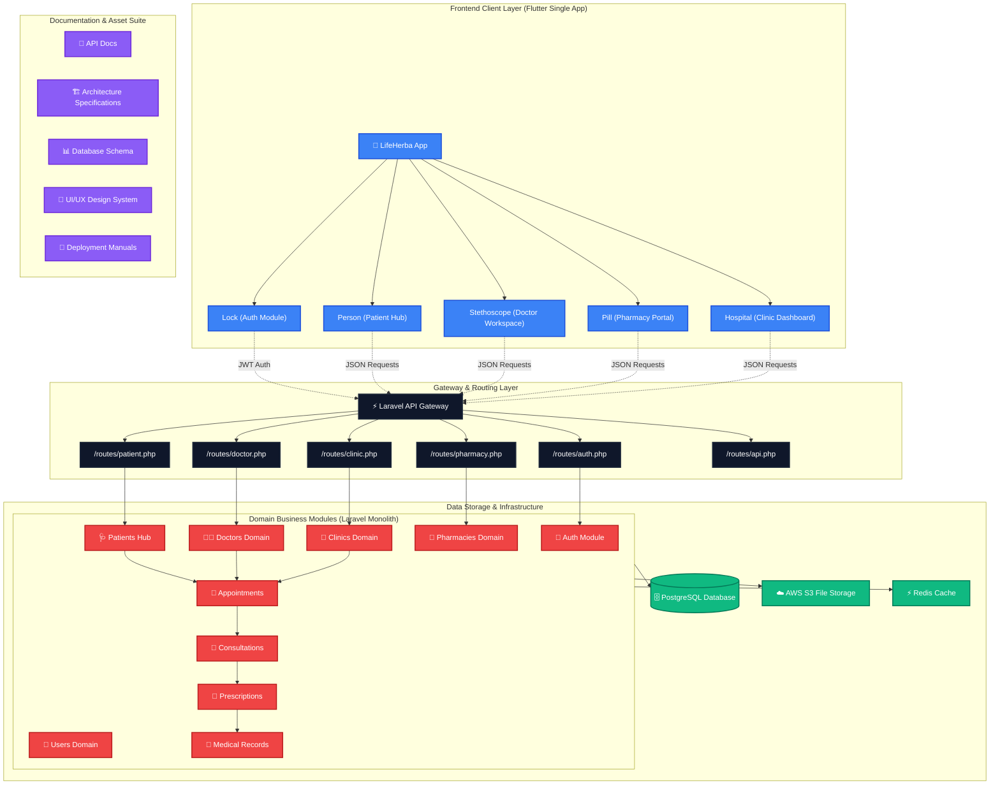

# 🌿 LifeHerba Application Suite

[](https://github.com/sajidtecho/LifeHerba)
[](https://flutter.dev)
[](https://laravel.com)

Welcome to the **LifeHerba** application suite, an enterprise-grade, multi-tenant digital healthcare ecosystem designed to seamlessly bridge the gap between patients, medical practitioners, physical clinics, and licensed pharmacies.

This repository serves as a monorepo containing the frontend client app, backend modular monolith, and standard project documentation.

---

## 🗺️ System Architecture Flowchart

Below is a detailed layout of the LifeHerba ecosystem, representing how data flows from the cross-platform Flutter application through the modular Laravel API gateway down to individual business domains and data stores:



---

## 📂 Repository Layout

The project structure is split into three main top-level directories:

```text
LifeHerba/
├── backend/                      # Laravel 10.x API Backend
├── frontend/                     # Flutter 3.x Cross-Platform Application
└── docs/                         # Central Technical Knowledge Base
```

---

### 📱 1. Frontend Client App (`/frontend`)
The frontend is built using **Flutter** to produce high-performance, responsive native clients for iOS, Android, and Web platforms. It follows a clean, feature-first modular architecture.

```text
frontend/
├── lib/
│   ├── core/                    # Core configs, system-wide constants, network interceptors
│   ├── shared/                  # Shared presentational widgets, UI components, utilities
│   ├── modules/                 # Isolated domain business logic and pages
│   │   ├── auth/                # Sign-in, registration, OTP validations, passwords
│   │   ├── patient/             # Patient hub: vitals, scheduling, personal profiles
│   │   ├── doctor/              # Doctor workspace: calendar, consult logs, queue management
│   │   ├── pharmacy/            # Pharmacy portal: order fulfillment, inventory, catalog
│   │   ├── clinic/              # Clinic dashboard: facility profiles, schedules, branches
│   │   ├── admin/               # Internal back-office and moderation controls
│   │   ├── consultation/        # Live messaging, audio/video channels, diagnostics
│   │   ├── appointments/        # Booking slots, schedule checks, queue tickets
│   │   ├── prescriptions/       # Digital prescription viewer, medicine logs
│   │   ├── medical_records/     # Secure health document store, laboratory reports
│   │   ├── notifications/       # Push reminders, SMS configs, in-app alerts
│   │   ├── payments/            # Checkout flows, invoice history, digital wallets
│   │   ├── reviews/             # Patient testimonials, star ratings, ratings logs
│   │   ├── search/              # Global searches for doctors, medicine, clinics
│   │   └── common/              # Common widgets unique to modules (e.g., standard layout templates)
│   ├── state_management/        # Central state orchestrators (BLoC / Providers)
│   ├── routes/                  # Centralized GoRouter routing tables
│   ├── theme/                   # Aesthetic styling tokens, typography, dark/light modes
│   ├── localization/            # Multi-language string tables (i18n)
│   └── main.dart                # Main bootstrap initialization file
├── test/                        # Automated unit and widget tests
└── pubspec.yaml                 # Flutter project dependency configuration
```

---

### 💻 2. Laravel Backend API (`/backend`)
The backend is powered by **Laravel** configured as a modular monolith. This maintains clean code separations and fast transaction speeds, allowing easy transitions into microservices if needed.

```text
backend/
├── app/                         # Core HTTP Kernels, Service Providers, and Middlewares
├── Modules/                     # Domain modules containing dedicated business logic
│   ├── Auth/                    # Authentication controllers, token management
│   ├── Users/                   # Base user models, roles, permissions mapping
│   ├── Patients/                # Medical history, patient registration data
│   ├── Doctors/                 # Practitioner schedules, professional bio, details
│   ├── Pharmacies/              # Store locations, pharmaceutical licenses, catalogs
│   ├── Clinics/                 # Clinic schedules, facility data, staffing profiles
│   ├── Appointments/            # Booking algorithms, timezone slot matrices
│   ├── Consultations/           # Video session handlers, consultation records
│   ├── Prescriptions/           # Digital signature integrations, prescription issues
│   ├── MedicalRecords/          # Encryption layers, medical upload handling
│   ├── Payments/                # Gateway handlers (Stripe / PayPal integrations)
│   ├── Notifications/           # SMS, Mail, and Firebase Notification dispatchers
│   ├── Reviews/                 # Patient feedback sentiment analysis and records
│   ├── Analytics/               # Health trends reporting and administrative datasets
│   └── Admin/                   # System configuration and global administrative tools
├── routes/                      # Route isolation for clean request dispatching
│   ├── api.php                  # Primary API hub & system health checkpoints
│   ├── auth.php                 # Registration and session routes
│   ├── patient.php              # Patient profile, appointments, billing endpoints
│   ├── doctor.php               # Doctor calendar, consultation routing
│   ├── pharmacy.php             # Pharmacy orders, inventory endpoints
│   ├── clinic.php               # Clinic profile and staff schedule routing
│   ├── admin.php                # Back-office monitoring endpoints
│   ├── appointments.php         # Scheduling, booking checks routing
│   ├── consultations.php        # Consultation logs, video calling endpoints
│   ├── prescriptions.php        # Prescription creation, signature verification
│   ├── payments.php             # Financial checkout, payment intents endpoints
│   └── notifications.php        # Direct user notifications, SMS logs
├── database/                    # Database structural layers
│   ├── migrations/              # Database schema tables definitions
│   ├── seeders/                 # Seed models for synthetic sample datasets
│   ├── factories/               # Model factories for robust automated testing
│   └── schema/                  # Plain SQL schema snapshots
├── storage/                     # Temporary cache, session files, locally saved uploads
├── tests/                       # Automated backend PHPUnit and Pest tests
├── config/                      # Laravel default system configuration profiles
├── bootstrap/                   # Cache files generated for routing/config optimization
└── public/                      # Web entry points and public assets
```

---

### 📄 3. Project Documentation Suite (`/docs`)
A dedicated knowledge base containing essential blueprints, diagrams, and deployment pipelines.

- **`api-docs/`**: REST API conventions, security protocols, and payload standards.
- **`architecture/`**: High-level designs, decoupling guidelines, and system-wide blueprints.
- **`database/`**: Entity-Relationship specifications, indexing structures, and migration policies.
- **`ui-ux/`**: Unified color palettes, UI theme tokens, wireframe plans, and user flows.
- **`deployment/`**: Docker pipelines, staging automation guides, and production setups.

---

## 🛠️ Getting Started

### Prerequisites
Make sure you have the following installed on your machine:
- **Flutter SDK**: `>= 3.0.0`
- **PHP**: `>= 8.1`
- **Composer**: `>= 2.0`
- **PostgreSQL**: `>= 14`
- **Node.js & NPM** (Optional, for front-end asset tooling)

---

### 1. Backend Setup (Laravel)
Navigate to the backend directory:
```bash
cd backend
```

Install Composer dependencies:
```bash
composer install
```

Create and configure your local environment settings:
```bash
cp .env.example .env
```
> Update the `.env` database details (e.g. `DB_DATABASE`, `DB_USERNAME`, `DB_PASSWORD`) to match your local PostgreSQL configuration.

Generate your secure application key:
```bash
php artisan key:generate
```

Run migrations and seed the database with synthetic data:
```bash
php artisan migrate --seed
```

Start your local backend development server:
```bash
php artisan serve
```
> The API will default to: `http://127.0.0.1:8000`

---

### 2. Frontend Setup (Flutter)
Navigate to the frontend directory:
```bash
cd ../frontend
```

Fetch all Flutter packages:
```bash
flutter pub get
```

Start the application on your connected device/emulator:
```bash
flutter run
```

---

## 🧪 Testing Guidelines

Continuous quality assurance is maintained with separate test suites:

### Backend Testing
Run PHPUnit test suites:
```bash
cd backend
php artisan test
```

### Frontend Testing
Run Flutter widget and unit tests:
```bash
cd frontend
flutter test
```

---

## 📄 License
This project is licensed under private distribution terms. All rights reserved.
