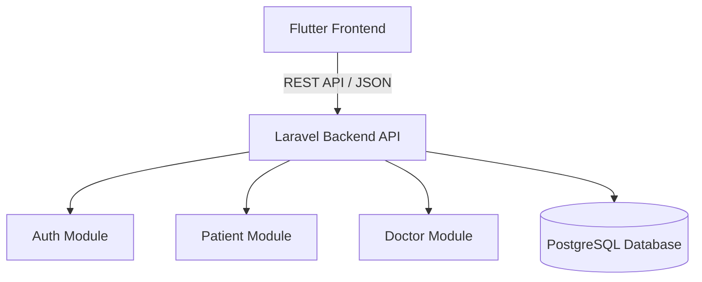

# System Architecture

This directory details the overall system architecture, pattern implementations, and structural guidelines for both the frontend (Flutter) and backend (Laravel).

## Overview
The application follows a decoupled client-server architecture with a Single Page Mobile/Web Client and a Modular Monolith API Backend.

## Frontend Architecture
- **Pattern**: Clean Architecture combined with Modular design (Feature-First structure).
- **State Management**: BLoC / Provider.
- **Rules**:
  - Keep domain logic separate from presentation.
  - Presentational widgets should remain stateless where possible.

## Backend Architecture
- **Pattern**: Modular Monolith design.
- **Rules**:
  - Each module should maintain its own core business logic, migrations, and routes.
  - Cross-module communication should happen via defined service contracts or event broadcasting.
